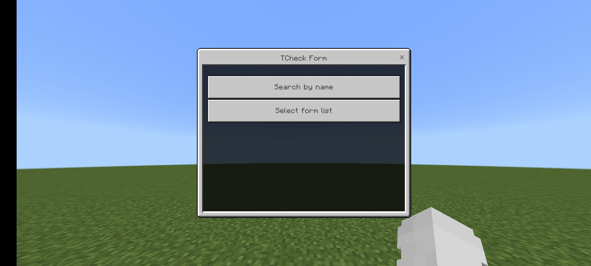
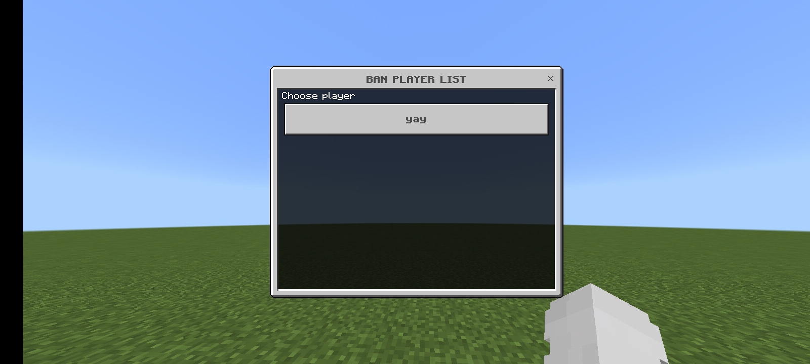
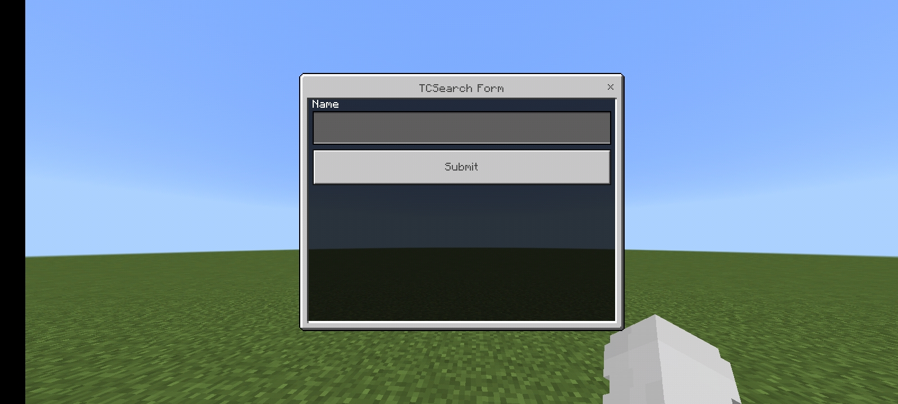

# TempBanUI 
Advance Temporary Ban with UI

---

# How to use
* Step 1: Type /tban to open player list
* Step 2: Select a player
* Step 3: Choose how long do you want and click Submit

OR

* Step 1: Type /tban <on|off> to turn hit player ban
* Step 2: Tap player
* Step 3: Choose how long do you want and click Submit

OR

* Step 1: Type /tban name to ban player
* Step 2: Choose how long do you want and click Submit

---

# Commands & Permissions & Aliases
| COMMAND | DESCRIPTION | PERMISSION | Aliases
|---|---|---|---
| /ban | Open player list | tempban.command | /tban |
| /ban <on - off> | Turn on/off hit ban | tempban.command | |
| /ban name | Ban player using name | tempban.command | |
| /tcheck | Check ban list | tempban.command.tcheck | |

---

# Features
* Ban Player Temporary
* Check Ban List
* UnBan Player
* Message Config
* SQLite3 Support

---

# Images

# Producers
- [@RealSonsaYT](https://twitter.com/RealSonsaYT)

# Contributors
- [@Laith98Dev](https://github.com/Laith98Dev)
